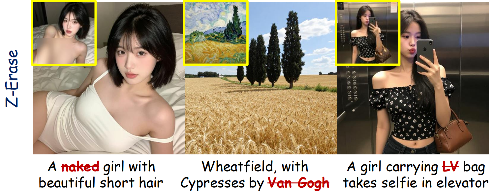

# Z-Erase: Enabling Concept Erasure in Single Stream Diffusion Transformers

### [ICML 2026]
[Nanxiang Jiang](https://nxjiang-jnx.github.io/), [Zhaoxin Fan](https://zhaoxinf.github.io/), [Baisen Wang](https://github.com/wbs2788), [Daiheng Gao](https://tomguluson92.github.io/), [Junhang Cheng](https://cjhcoder7.github.io/), [Jifeng Guo](https://openreview.net/profile?id=~Jifeng_Guo1), [Yalian Qin](https://openreview.net/profile?id=~Yalan_Qin1), [Yeying Jin](https://jinyeying.github.io/), [Hongwei Zheng](https://openreview.net/profile?id=~Hongwei_Zheng4), [Faguo Wu](https://openreview.net/profile?id=~Faguo_Wu1), [Wenjun Wu](https://iai.buaa.edu.cn/info/1013/1093.htm)

<p align="center">
  <a href="https://arxiv.org/abs/2603.25074"></a>
  &nbsp;
  <a href="https://nxjiang-jnx.github.io/Z-Erase-web/"></a>
  &nbsp;
  <a href="https://github.com/nxjiang-jnx/Z-Erase"></a>
  &nbsp;
  <a href="LICENSE"></a>
</p>


<p align="center">
  
</p>

<p align="center">
  
</p>

Z-Erase is an open-source project for Concept Erasure in Single Stream Diffusion Models: e.g. Z-Image.


To fine-tune Z-Image-Turbo and fully reproduce our method, you need at least one GPU with **80 GB of VRAM**.


For inferencing images with our pre-trained safetensors, you need at least one GPU with **30 GB of VRAM**.


## Features

- ✅ Supports **[diffusers]**
- ✅ Easy to extend and integrate

## Setup


**1. Clone and create a conda environment**

```bash
git clone https://github.com/nxjiang-jnx/Z-Erase.git
cd Z-Erase
conda create -n zerase python=3.10 -y
conda activate zerase
```

**2. Install PyTorch and dependencies**

Install PyTorch for your CUDA version from [pytorch.org](https://pytorch.org/get-started/locally/), then:

```bash
pip install -r requirements.txt
```

**3. Install local `peft` and `diffusers`**

You have to use the exact code of `peft` and `diffusers` in this repository (**NOT** from the official websites), because I've made some modifications.

Install local packages:

```bash
cd peft
pip install -e .[torch]
# or: python setup.py install

cd ../diffusers
pip install -e .[torch]
# or: python setup.py install

cd ..
```

**4. Download Z-Image-Turbo weights**

Default model: [`Tongyi-MAI/Z-Image-Turbo`](https://huggingface.co/Tongyi-MAI/Z-Image-Turbo) (see `config/config.yaml`).

```bash
huggingface-cli download Tongyi-MAI/Z-Image-Turbo --local-dir ./models/Z-Image-Turbo
```

Set the path in `config/config.yaml`:

```yaml
pretrained_model_name_or_path: "./models/Z-Image-Turbo"
```

Or keep the Hub model ID and weights will be cached under `~/.cache/huggingface/` on first load.

> `train.sh` sets `HF_HUB_OFFLINE=1`. Download weights before training, or unset that variable.

**Verify**

```bash
python -c "from diffusers import ZImagePipeline; from peft import LoraConfig; print('OK')"
```

## Training

Take erasing the "nude" concept as example:

First, create `image/nude` and put 3-5 images in it that highlight the concept you want to remove. Note that these images are just placeholders that ensure the code to run, and they are not be used in this final version of our method.

Then, train the LoRA weights using the default configurations:

```bash
bash train.sh
# or
python train_ZImage_lora.py --config config/config.yaml
```

Finally, after approximately 40 minutes of training, you'll get `ZImage-erase-nude/text_masked_lora.safetensors`.

## Quick Inference

I've included a trained `ZImage-erase-nude/text_masked_lora.safetensors` for erasing "nudity" in the current repository. 

Quick inference by running:

```bash
python single_image_generation.py
```

> [!CAUTION]
>
> Note that `lora_scale` (Line 39) is super important for our method to function effectively, which defines the strength of concept erasure. For nudity concepts, I’ve set it as 15 for a good fit. For other concepts, use `find_optimal_scale.py` (enter your `lora_path` at Line 97) to search for a good fit.


## Acknowledgments

This project is inspired by and builds upon the work of [EraseAnything](https://github.com/tomguluson92/EraseAnything),  [Erasing Concepts from Diffusion Models](https://github.com/rohitgandikota/erasing) and other open-source projects. We thank the community for their valuable contributions.

## Citation

If you use this project in your research, please cite:

```bibtex
@article{jiang2026zerase,
  title={Z-Erase: Enabling Concept Erasure in Single-Stream Diffusion Transformers},
  author={Nanxiang Jiang and Zhaoxin Fan and Baisen Wang and Daiheng Gao and Junhang Cheng and Jifeng Guo and Yalan Qin and Yeying Jin and Hongwei Zheng and Faguo Wu and Wenjun Wu},
  journal={Forty-Third International Conference on Machine Learning},
  year={2026}
}
```

## Contact

Please contact [Nanxiang Jiang](https://nxjiang-jnx.github.io/) ( jiangnx@buaa.edu.cn) for technical questions.
